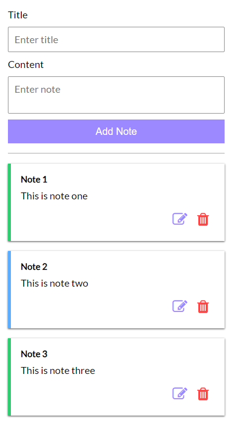
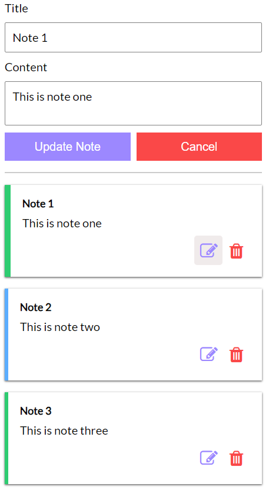

## Notes App

- Clone the app and add your own state management logic
- For reference, structure of state, actions and reducer are given in `src/store/reference.js`
- I have added multiple handlers where you can write your own state update logic

<table>
<tr>
  <td>
    
  </td>
  <td>
    
  </td>
  </tr>
</table>
